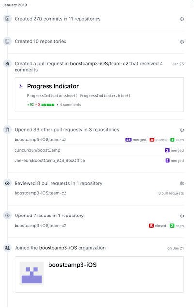

# 2019年 1月

### 프로젝트 배경

연말이 되면 여러 커뮤니티에서 개발자들의 회고를 어렵지 않게 찾아볼 수 있습니다. 아직 스스로를 개발자라고 자신 있게 소개하기가 힘든 지금, 개발자가 되기 위한 노력의 기록을 이 곳에 담기로 하였습니다.

프로젝트 이름은 '月刊 Presto'이며, '月刊 尹鍾信'에서 그 이름을 따왔습니다. 제 이름이 순우리말이 아니었다면 'Presto' 대신 제 이름을 한자로 작성하여 이름 지었을 것입니다.

---

### GitHub 활동 요약

작년 11월 중순부터 1일 1커밋을 하기로 마음먹었고 현재까지 끊어지지 않은 상태입니다.

이번 1월 한달 동안에는 330건의 컨트리뷰션을 하였습니다. 비율로 보면 커밋이 약 50%, 풀리퀘스트가 약 30%입니다. 

부스트캠프를 하면서 풀리퀘스트와 코드 리뷰, 이슈의 비율이 크게 늘었습니다. 부스트캠프 이전에는 깃허브를 사실상 원격 코드 저장소의 용도로만 사용했는데, 이번 기회를 통해 깃허브를 협업을 위한 도구로 사용하는 것 같아 뿌듯합니다.

---

### NEXTERS

지난 1년 동안 활동했던 YAPP은 뒤로 하고, NEXTERS 14기 개발자 포지션에서 활동중입니다. 12월 31일에 NEXTERS Organization에 초대받았네요.

NEXTERS 12기 면접에서 어떠한 질문에도 답할 수 없어 면접장을 나와 집에 가면서 스스로에게 화가 많이 났던 것이 기억나는데, 이번에는 모든 질문에 자신 있게 답할 수 있었다는 점이 좋았습니다. 실력 있는 학생과 직장인 사이에서 프로젝트를 진행할 수 있어서 좋습니다.

특히 이 곳에서는 서브 개발자 포지션에서 프로젝트를 진행하고 있습니다. 돌아보면 다른 곳에서는 리드 개발자 포지션에서 프로젝트를 진행했던 것 같습니다. 리드 개발자의 위치에서 고민하고 배울 수 있는 점도 정말 많았지만, 서브 개발자의 위치에서 저보다 훨씬 실력 있는 분과 함께 프로젝트를 진행하며 많이 배울 수 있을 것 같습니다.

두 달의 활동 기간 중 벌써 한 달이 지났습니다. 부스트캠프 등으로 요즘 많이 바쁘지만 성공적으로 프로젝트를 마무리할 수 있도록 노력해야 하겠습니다.

---

### 부스트캠프 3기 iOS

커넥트재단에서 진행하는 부스트캠프 과정에 참여하고 있습니다. 지금 이 글을 작성하고 있는 시점을 기준으로 2주의 시간이 흘렀습니다.

이 활동을 통해 정말 많은 것을 배우고 있습니다. 오픈소스 사용을 지양하기 때문에 네트워킹 모듈이나 까다로운 뷰를 직접 구현해야 하기 때문에 많은 것을 고민하게 됩니다. 팀원들과 동일한 코딩 컨벤션을 가져가려 노력하여 마치 한 사람이 작성한 코드인 것처럼 인식하게 되는 것도 신기합니다. 또한 하루종일 개발에만 집중하기 때문에 개발의 관점에서 치열하게 고민하며 코드를 작성할 수 있게 됩니다.

풀리퀘스트를 통한 코드 리뷰는 정말 재밌는 경험이었습니다. 이러한 코드는 왜 이렇게 작성하였는지 물을 수 있고 답을 들을 수 있다는 것이 정말 좋습니다. 다른 사람의 스타일을 보고 내가 가지고 있는 것과 비교하며 더 좋은 것을 선택할 수 있는 것도 좋습니다.

SwiftLint, SwiftGen, xUnique 등 iOS 개발에 도움을 주는 스크립트부터 Travis CI 등 좋다고는 들었지만 실제로 적용하기는 쉽지 않은 것들을 시도하고 있습니다. 이것들을 적용하지 않았을 때와 비교하며 좋았던 점을 기록하고 다른 사람들과 이 경험을 공유하는 것이 중요할 것 같습니다.

월요일과 목요일 밤에 진행되는 튜터링 시간은 일주일 중 가장 많은 지식을 접하여 가장 흥분되는 시간입니다. 튜터링을 통해 Dependency Injection 및 Unit Test, Test Driven Development를 배울 수 있었고, 현재 진행중인 프로젝트에 접목하려는 노력을 하고 있습니다. 정말 어렵고 지금도 어렵지만 꾸준히 공부하고 서서히 접목하며 개발의 관점에서 질 높은 결과물을 내기 위해 노력하고 있습니다.

특히 테스트 케이스를 작성하며 특정 모듈에 대한 Coverage가 100%에 가까워지는 경험은 매우 짜릿했습니다. 마치 어떤 게임을 하는 것 같았습니다. 100이라는 숫자를 달성하기 위해 테스트 케이스 및 더 좋은 코드를 고민하게 되었습니다.

이제 남은 기간은 약 3주 정도 뿐입니다. 개발 관점에서도 단단하고 자랑할만한 코드를 작성하는데 초점을 맞추어 이 과정이 제가 개발자가 되려고 하는 것에 있어서 더할나위 없이 좋은 디딤돌이 되게끔 해야 하겠습니다.

---

### 토이 프로젝트 진행

동아리에서 알게 된 사람들과 작은 프로젝트를 진행하였습니다. 대학교 공지사항을 한데 모으고, 키워드를 등록하여 내가 관심 있어하는 게시물을 쉽게 확인할 수 있게 하기 위한 애플리케이션입니다.

사실 학교별로 스크래핑 정책을 하나하나 작성해야 하기 때문에 노가다성이 짙은 작업이라고 할 수 있지만, 코드를 잘 작성한다는 관점에서 신경을 많이 쓰려 노력하였습니다. 특히 이 프로젝트를 진행하면서 Swift의 프로토콜을 본격적으로 활용할 수 있었습니다. 이 프로젝트를 리팩토링하면서 RxSwift와 MVVM을 시도할 예정입니다.

1월 31일에 앱스토어에 릴리즈되었습니다. 그 날에 참고 부문 12위에 랭크되고, 130여 건의 다운로드수를 기록하는 등 의미 있는 성과가 나와 뿌듯합니다. 가능성을 확인한 것 같아 유지보수 및 디자인 보강에 좀더 힘을 기울일 수 있을 것 같습니다.

---

### 외주 경험

지인이 하는 사업을 위한 iOS 애플리케이션 개발에 참여했습니다. 이전에는 지금까지 나는 내가 배운 것으로 돈을 벌 수 있는 실력을 갖추었는지, 책임감을 가지고 프로젝트를 수행할 수 있는지 의문이 들어 외주에 대해서 부정적인 생각이 많았는데, 25살이 되면서 슬슬 돈을 벌어보아야 하지 않을까 하는 생각이 들어 외주를 진행해 보았습니다.

외주를 진행하면서 한가지 명확하게 느낀 것은, 돈이라는 것이 얽히고 기한이 명확한 프로젝트는 정말 재미가 없다는 것입니다. 물론 실제로 어떠한 사업의 고객을 마주할 애플리케이션을 만드는 것은, 개인이나 동아리에서 의기투합하여 진행하는 프로젝트와는 성격이 다르다는 생각은 했습니다. 하지만 생각한 것 이상으로 크게 다가온 것 같습니다.

기한을 맞추어야 해서 밤을 새고 코드를 의식의 흐름대로 작성하는 등의 작업을 막판에 진행하면서 개발에 대한 흥미를 잃어갔습니다. 기획 및 디자인 포지션과 조화가 정말 잘 되어야 프로젝트 진행이 수월하다는 것을 다시금 깨달았습니다. 무엇보다도 아직 외주를 진행할 만한 실력은 되지 않는다는 것을 느꼈습니다. 다시 말해서, 좋은 코드 구조를 고민하고 적용하면서 기한이 정해진 프로젝트를 진행할 만큼의 실력은 가지고 있지 않다고 생각했습니다.

QA도 진행하지 않고 새벽에 부랴부랴 심사 제출을 했고, 리젝을 당했습니다. 버그는 평소 같았으면 실수하지 않을 곳에 곳곳이 숨어 있었습니다. 이러한 한심한 코드를 보고 있자니 착잡했습니다.

아무튼 이번 경험을 통해 얻어간 것이 많습니다. 일단은 꾸준히 토이 프로젝트를 진행하는 것은 그대로 가져가고, 이러한 형태의 외주를 진행하는 것은 다시 생각해봐야할 것 같습니다.

---

### 오픈소스 도전

외주를 진행하면서 줄자와 비슷하게 생긴 뷰를 작성해야할 필요가 있었는데, 적당한 라이브러리를 찾을 수 없어서 직접 구현했습니다. 좌우 스와이프가 가능하고 눈금에 맞는 값이 나오는 기능을 가지고 있는데, 적당한 라이브러리가 없었기 때문에 이를 오픈소스로 만들어 배포하면 재밌겠다는 생각을 했고 실행에 옮겼습니다.

하지만 그렇게 쉬운 작업은 아니었습니다. 필요한 API만 제공하기 위해 프로퍼티를 숨기고, 오픈소스 사용자가 사용하기를 원하는 것만 공개해야 했습니다. 뷰를 모듈화하는 작업도 쉽지 않았습니다. 특정 컨트롤러에 종속되지 않아, 뷰 자체의 기능을 모듈화하여 제공하는 것은 생각만큼 쉬운 일이 아니었습니다. 이미 공개되어 있는 오픈소스를 참고하며 델리게이트 메소드 등을 작성하려 했으나 생각만큼 잘 되지 않았습니다.

일단은 지금 하고 있는 것이 많아 접어둔 상태입니다. 하지만 조만간 꼭 완성시켜 Cocoapods에 배포하여 미약하지만 오픈소스 활동에 한발짝 나아가려 합니다.

---

### 마무리

이렇게 간단하게 2019년 1월의 활동을 정리해 보았습니다. 이런 식으로 회고록을 작성하는 것이 맞는지는 잘 모르겠습니다. 글 자체를 써내려가는 것도 마냥 쉬운 일은 아닌 것 같습니다. 하지만 지난 한달 간 진행한 노력들을 정리한다는 목적으로 이 프로젝트를 진행하는 것은 좋은 것 같습니다. 

앞으로도 이 길이 정도 되는 글은 매달 작성할 수 있도록 노력을 게을리하지 않아야 하겠습니다.

글 자체도 더 잘 쓸 수 있게 되기를 바랍니다.