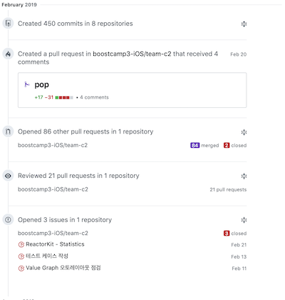

# 2019年 2月

두 번째 회고록입니다. 이번 한 달은 두 개 정도의 키워드로 요약이 가능할 것 같습니다.

---

### GitHub 활동 요약

작년 11월 중순부터 이어진 1일1커밋은 아직도 끊어지지 않았습니다. 

> 사실 부스트캠프가 끝나고 며칠 동안은 의미 없는 커밋으로 이어갔는데, 끊어지면 아깝잖아요. 일주일 내내 의미 없는 커밋을 하는 것만 안하면 되지 않겠습니까.

이번 1월 한달 동안에는 약 600건의 컨트리뷰션을 하였습니다. 이번 달의 영향으로 커밋의 비율이 40%가 되었으며, 풀리퀘스트 비율이 크게 늘어 45%가 되었습니다. 코드 리뷰가 10% 정도 됩니다. 이게 다 부스트캠프 덕분입니다.

전체 450커밋의 90% 정도가 부스트캠프 레포지토리에 집중되어 이번 한달은 부스트캠프에 몰두했다는 것을 알려주었습니다.

---

### 부스트캠프 3기

부스트캠프 3기가 끝났습니다. 한달 동안 커넥트재단에 모여 하루하루 해커톤을 한 느낌이었습니다. 일주일에 두 번 있는 멘토링 시간은 매우 기다려지는 시간이었으나 22시까지 있는 것은 힘들긴 힘들었습니다. 그래도 그 덕분에 정말 많은 것을 듣고 배울 수 있었습니다.

이번 활동을 통해 느낀 것을 크게 세 가지 정도로 요약해볼 수 있을 것 같습니다.

1. 코딩 컨벤션의 중요성
2. CI / Unit Test / Code Coverage
3. Code Review

평소에도 좋은 코드는 다른 사람도 잘 읽을 수 있는 것이라는 생각을 갖고 있어서, 특히 개발자들만 모여서 프로젝트를 진행하는 부스트캠프 활동에서는 이를 강조하고자 하였습니다. StyleShare가 공유한 스타일 가이드를 준수하고, SwiftLint의 룰을 지켰습니다. 특히 StyleShare가 제안하는 '한 줄 99자' 규칙을 지키기 위해 SwiftLint의 `line_length` 룰을 수정하여 99자가 넘어가면 경고, 120자가 넘어가면 에러를 발생시켰습니다. 이를 통해 전체 프로젝트에서 외관상 균일한 코드 구조를 갖게 하여 가독성을 높일 수 있었습니다.

또한 코드 리뷰시 팀에서 정한 코딩 컨벤션을 위반하는 것을 지속적으로 지적하였습니다. 사실 프로젝트 막바지에 접어들면서 코딩 컨벤션을 꼬투리잡아 코멘트를 다는 것은 정말 귀찮고 소모적일 일이 되었습니다. 뻔히 SwiftLint가 경고를 뿜고 있을 텐데. 이러한 코드는 우리가 지양하자고 한 것들인데 이렇게 작성해서 풀리퀘스트를 날리다니. 역시 협업은 쉬운 것이 아님을 느끼면서도 최대한 코드를 일관되게 유지하기 위해 노력하였습니다.

물론 이외에도 Swift API Guideline에 맞는 네이밍, 고급 문법 등 다양한 부분에서 토의할 수 있었고, 재밌는 경험을 할 수 있었습니다. 앞으로도 코드 리뷰를 생활화하는 팀에서 일할 수 있기를 기대하고 있습니다.

Travis CI를 적용하여 풀리퀘스트한 빌드가 실행 가능한 것인지, 테스트가 통과하는 것인지 알 수 있게 하여 머지 여부를 결정하였습니다. 튜터님이 프로젝트 초기에 Dependency Injection을 제안해주신 덕분에 프로젝트 후반부에 Unit Test를 수월하게 진행할 수 있었습니다. 어떠한 코드가 정말로 신뢰 가능한 것인지 이를 통해 확인할 수 있었고, 리팩토링 단계에서 큰 이점을 취할 수 있었습니다. 코드 커버리지를 끌어올려서 정말로 신뢰 가능한 코드의 비율을 높였습니다. 이 모든 것들은 사람들이 좋다고는 말하지만 실제로 적용하기는 쉽지 않은 것이었습니다. 이번 프로젝트에 이것들을 적용하면서 사람들이 말하는 *좋은 것*이 무엇인지 체감할 수 있었고, 이를 통해 느끼는 감정들이 좋았습니다. 다음 프로젝트에도 꼭 단위 테스트를 적용할 것이며, 기회가 된다면 TDD를 시도해볼 생각입니다.

마지막 날에 있었던 네트워킹데이 때는 기업 관계자들 앞에서 발표도 해볼 수 있었습니다. 전날 예행 연습 때에 생각보다 많이 긴장해서 최대한 연습을 많이 해보려고 했는데, 잘 마무리한 것 같아 다행입니다. 이제 좋은 기회가 오기를 바랄 뿐입니다.

> 저는 지금 학교를 다니고 있지만 언제든 불러주신다면 학교 때려치고 열심히 일할 준비가 되어 있답니다..!

---

### NEXTERS

NEXTERS 14기 활동도 끝났습니다. 정말 이 동아리는 대단한 동아리였습니다. 엄청난 결과물이 마지막 세션에 쏟아져 나왔습니다. 특히 개인적으로 단축 URL 서비스가 가장 흥미로웠습니다. 부스트캠프 발표 때도 GitHub나 App Store 링크를 이 서비스를 사용해서 줄여 사용했습니다. 직접 말하지는 못했지만, 이 서비스 만들어 주셔서 감사하다는 말씀을 드리고 싶습니다.

하지만 우리 팀에 아쉬움이 남는 것은 어쩔 수 없을 것 같습니다. 디자이너 분들이 알아서 작은 기획과 작은 와이어프레임을 만들어 주셨는데, 개발자들이 이것을 마무리하지 못했습니다. 저도 부스트캠프에 몰두해야 하긴 했지만, 어쨌든 프로젝트를 기한 내에 완성시키지 못한 것은 분명한 잘못입니다. 하지만 우리는 이제 시작입니다. 15기 시작 전까지 프로젝트를 마무리할 수 있으면 좋겠습니다.

> 디자이너님들... 프로젝트 마무리 못해서 죄송합니다...

15기를 바로 이어서 할지 안할지는 현재로서는 잘 모르겠습니다. 만약 일을 하게 된다면 유예할 생각입니다.

---

### 마무리

2018년 말에 설정한 2019년 시작의 목표였던 부스트캠프와 NEXTERS 모두를 경험할 수 있었고 마무리했습니다. 특히 부스트캠프는 정말로 저의 개발 커리어를 몇 단계는 올려준 귀한 활동이었습니다. 부스트캠프 시작 전에 적어 냈던, *개발자가 되기 위해 더할나위 없는 디딤돌*이 된 것 같아 좋습니다.

기업들로부터 별 소식이 없다면 학교를 다니게 될텐데, 학교를 다니면서도 꾸준히 프로젝트를 진행하고 개발 공부를 하도록 노력해야 하겠습니다. 