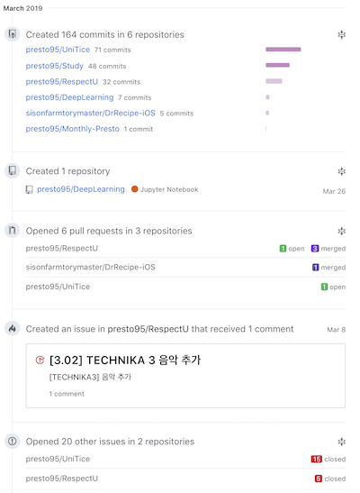

# 2019年 3月

세 번째 회고록입니다.

---

### GitHub 활동 요약

여전히 1일 1커밋을 실천하고 있습니다. 부스트캠프가 끝나고 개인 프로젝트 리팩토링에 주로 몰두하다보니 풀리퀘스트 등 협업 위주 기능을 많이 사용하지 않았고, 커밋 자체도 절대적인 수치가 많이 줄어들었습니다. 대신 그동안 하지 못했던 공부를 하면서 기록을 남기는 것으로 공백을 메꾼 것 같습니다. 프로젝트를 진행하면서 얻는 것도 많겠지만, 기술 문서나 블로그 아티클 등을 읽으면서 공부하는 것도 중요하니까요.

---

### 학교

여느 때처럼 3월이 되어 4학년 1학기를 다니는 대학생이 되었습니다. 하지만 3주도 되지 않아서 학교를 다닐 수 없게 되었습니다. 휴학을 하지도 못했고, 출석인정원도 반려되었지만, 일단 생각하지 않고 소중한 기회를 놓치지 않기 위해 노력할 예정입니다.

---

### 개인 프로젝트 리팩토링

RespectU 프로젝트와 다연결 프로젝트를 리팩토링했습니다. 두 프로젝트 모두 부스트캠프를 통해 익힌 코딩 컨벤션 등 전체적으로 일관된 코드를 유지하도록 하였습니다.

RespectU 프로젝트에서는 기능을 분리하고, 올바르지 않은 곳에 위치한 메소드의 위치를 적절하게 바꿔주고, 문서화 주석을 사용하는 것에 중점을 두었습니다. 사실 앱 자체는 가만히 놔두어도 이제는 데이터만 업데이트해주면 되는데, 부스트캠프가 끝나고 코드를 다시 보니 너무나 말이 안되는 것들이 많이 보여서 갈아엎기로 마음먹었습니다.

일단 성과를 기록하고 계산하는 부분에 대하여 서비스 클래스를 작성하여 분리하였고, 이를 다른 파일에서 가져와 사용할 수 있게 하였습니다. UIKit 타입의 익스텐션에 위치했던, 프로퍼티를 업데이트하는 메소드는 프로토콜로 빼내어 해당 프로토콜을 준수하는 타입만 해당 기능을 사용할 수 있게 하였습니다. 사실 당연히 이렇게 해야 했는데, 이전의 저는 그렇게 하는 방법을 알지 못했나 봅니다. 이제라도 알아서 정말 다행이라는 생각이 들었습니다.

또한 문서화 주석을 작성하는 것에 많은 공을 들였습니다. 어쨌든 이 프로젝트는 햇수로 2년 정도 계속 유지보수되고 있지만, 그 주기가 1분기 정도 되기 때문에, 간만에 프로젝트를 열면 일부 작성한 코드를 이해하지 못하게 되는 경우가 있었습니다. 이를 해소하여 유지보수에 드는 시간과 노력을 줄이기 위해 문서화 주석을 모든 타입, 메소드에 대하여 작성하였습니다. 특히 메소드에 대해서는 요약 정보, 매개변수 정보, 반환값 정보 등을 명시하여 나중에 확인하기 쉽도록 하였고, 영어로 작성하여 혹시나 영어로 코드 리뷰를 하거나 주석을 작성하는 기업에 들어가 프로젝트를 진행하게 되었을 때 적응을 빠르게 할 수 있도록 하였습니다.

다연결 프로젝트에서는 RxSwift 및 ReactorKit을 사용하여 전체 구조와 로직을 수정하였습니다. RxSwift에 빨리 익숙해지고 싶었지만, 러닝 커브가 상당한 것이 사실이었습니다. 이를 해소하기 위해 하루에 두세개의 Rx 오퍼레이터에 대하여 정리하여 수많은 오퍼레이터에 조금이나마 익숙해지기 위해 노력하였습니다. 또한 MVVM 아키텍쳐를 공부하는 것 자체에도 많은 시간을 사용할 것 같아서, 대신 ReactorKit 프레임워크를 사용하여 앱 전체를 리모델링하였습니다.

처음엔 많이 헤매기도 했는데, ReactorKit이 제안하는 예제도 한번씩 다 작성해가면서 코드를 분석했고, 덕분에 어느 정도는 ReactorKit이 추구하는 흐름에 맞게 앱을 작성하였다고 생각합니다. RxSwift도 입문 단계는 벗어난 것 같아 좋았습니다.

RespectU 프로젝트는 나름 상당히 규모가 큰 반면에, 다연결 프로젝트는 그 크기도 적당하고, 구현 자체에 큰 어려움도 없어서 좋은 실험체가 될 것 같습니다. 앞으로 어떤 것을 더 배워서 적용해나갈 수 있을지 기대가 됩니다.

---

### 기업 면접

부스트캠프를 통해서 감사하게도 여러 기업에서 인턴십 참가 여부를 여쭤보셨고, 모든 곳에 대해서 온라인 테스트를 통과하고 면접을 볼 기회를 얻게 되었습니다. 또한 내가 정말 새발의 피고, 알아야 할 것들이 너무나 많다는 것을, 기본적인 것조차 잘 알지 못한다는 것을 다시금 깨닫게 되었습니다.

면접장에서는 얕게 알고 있던 지식이 전혀 통하지 않았습니다. 그동안 주변 사람들에게 퍼뜨린 얕고 잘못된 지식이 면접장에서 여실히 드러났습니다. 매 면접 때마다 치부를 드러낸 듯한 느낌을 받았습니다. 

하지만 그 덕분에 어떤 것을 모르고, 어떤 것을 공부해야 하며, 어떻게 공부해야 하는지, 더 나아가 앞으로 어떠한 것을 해야 하는지 알게 되었습니다. 면접장에서 대답하지 못했거나 완벽하게 대답하지 못한 것들을 복기하여 정리하였고, 이 과정에서 정말 효율적인 공부를 할 수 있었습니다. 역시 소문대로 면접을 보는 것 자체가 정말 중요한 것이었습니다.

기술적인 부분이 아닌, 면접 자체의 스킬 같은 부분도 중요하다고 느꼈습니다. 아는 것을 정리하여 조리있게 말하는 방법, 면접관을 대하는 자세와 태도 등에 대해서도 직접 느끼고 많이 배웠다고 생각합니다.

---

### 인턴

결과적으로 LINE Financial Plus에서 두 달 동안 인턴십 프로그램에 참가하게 되었습니다. 첫 인턴, 첫 직장인 만큼 정말 설렙니다. 부스트캠프는 그나마 한 달이었는데, 이제는 두 달 동안 죽었다고 생각하고 해야겠네요.

---

### 마무리

이번 달 보다는 다음 4월이 정말 기대가 됩니다. 두 달의 인턴 기간 동안 어떤 것을 하게 될지, 얼마나 더 성장할 수 있을지 기대가 됩니다. 4월의 회고록에 기분 좋은 글들이 적힐 수 있도록 열심히 해야겠습니다.